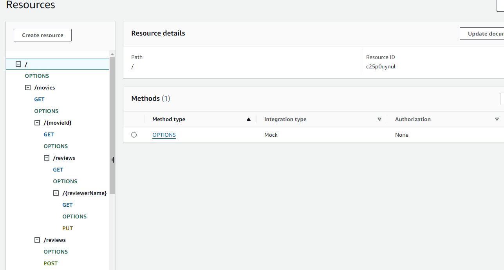
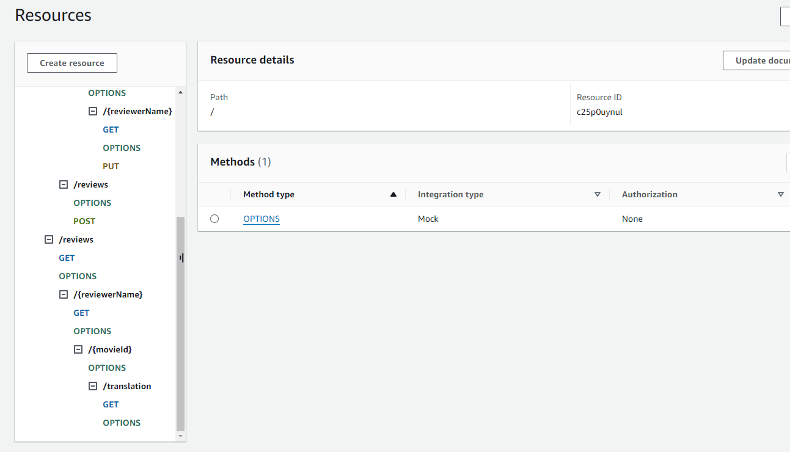
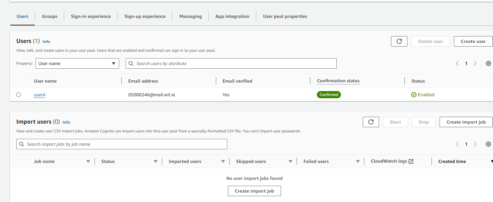
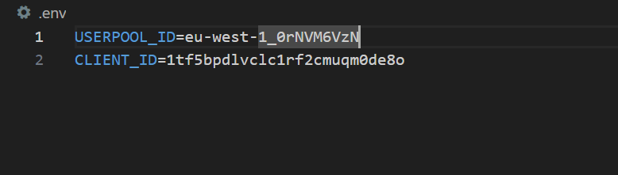
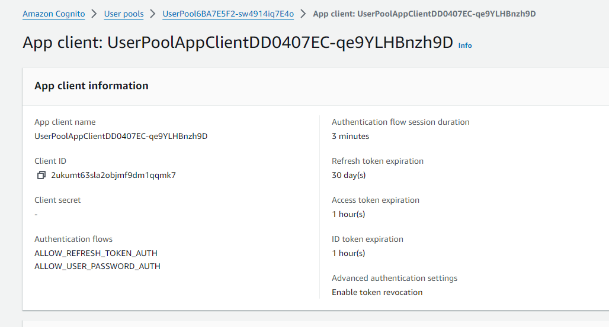
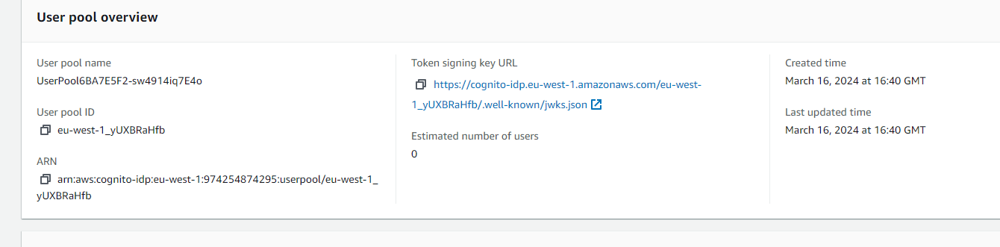

## Serverless REST Assignment.

__Name:__ Jessica McCabe

__Video demonstration:__ ..... URL of your Youtube video demonstration ....

This repository contains an implementation of a serverless REST API for the AWS platform. The CDK framework is used to provision its infrastructure. The API's domain context is movie reviews.

### API endpoints.

[ Provide a bullet-point list of the app's endpoints (excluding the Auth API endpoints you have successfully implemented in full. Omit those in the assignment specification that you did not complete.]
e.g.
 
+ POST /movies/reviews - add a movie review.
+ GET /movies/{movieId}/reviews - Get all the reviews for the specified movie.
+ GET /movies/{movieId}/reviews?minRating=n - Get the reviews for the specified movie with a rating greater than the minRating.
+ GET /movies/{movieId}/reviews/{reviewerName} - Get the review written by the named reviewer for the specified movie.
+ PUT /movies/{movieId}/reviews/{reviewerName} - Update the text of a review.
+ GET /movies/{movieId}/reviews/{year} - Get the reviews written in a specific year for a specific movie.
+ GET /reviews/{reviewerName} - Get all the reviews written by a specific reviewer.
+ GET /reviews/{reviewerName}/{movieId}/translation?language=code - Get a translated version of a movie review using the movie ID and reviewer name as the identifier.

[Include screenshots from the AWS management console (API Gateway service) that clearly show the deployed API ( ensure the font size is legible). ]

### Authentication (if relevant).

[Include a screenshot from the AWS management console (Cognito User Pools) showing a confirmed user account.]

### Independent learning (If relevant).

[ Briefly explain any aspects of your submission that required independent research and learning, i.e. typically related to the higher grade bands. State the source files that have evidence of this.

## Multi Stack

### CognitoStack
This stack creates a cognito user pool which will be used from all other stacks. Deletion protection is set to true for the stack itself and for the userpool. 

https://docs.aws.amazon.com/AWSCloudFormation/latest/UserGuide/using-cfn-protect-stacks.html
https://docs.aws.amazon.com/cli/latest/reference/cloudformation/update-termination-protection.html

### AuthStack
This stack creates the authentication API and uses the userpool created in the cognito stack. This is done by the use of environment variables in a config file which references the userPoolId and clientID of the existing userPool. 

### AppStack
This stack create the app api and uses the userpool created in the cognito stack. This is done by the use of environment variables in a config file which references the userPoolId and clientID of the existing userPool. This is only used for the protected endpoints which are PUT and POST.

https://conermurphy.com/blog/making-environment-variables-effortless-aws-cdk-stacks

### Stack Deployment Notes
Required Dependencies:
You will need to create a .env file at the root of the project. This file will store the user pool client ID and userpool ID in variables. 

USERPOOL_ID=<your-userpool-id>
CLIENT_ID=<userpool-client-id>

You are required to deploy the CognitoStack first, this will create your userpool and you will then take the userpool ID and Client ID from the created userpool and update your .env file with the values.

cdk deploy CognitoStack

You can then deploy both the AuthStack and the AppStack together

cdk deploy AuthStack AppStack